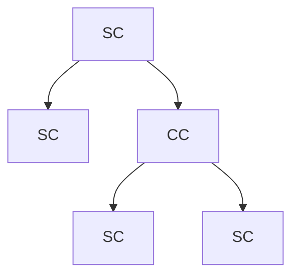
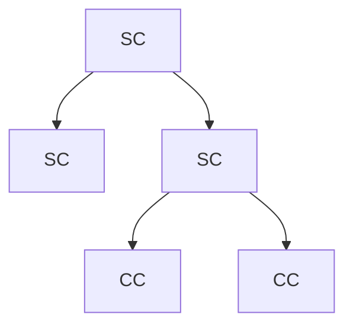

## NextJs Docs

## Project Setup

### Creating Project

Create Project
`npx create-next-app@latest my-app`
Run Project
`npm run dev`

### VS Code Extensions

1. ES7+ React/Redux/React-Native/JS snippets
2. Prettier
3. ESLint
4. Auto Rename Tag
5. vscode-icons

## React Server Components

1. Server Components: 
    ➡️ By default.
    ➡️ Use for server side tasks such as reading files or fetching data.
    ➡️ They cant use react hooks and user interactions.
2. Client Components
    ➡️ Add "use client" at the top.
    ➡️ Can not perform server side tasks.

## Routing

### Concepts

➡️ The route files must be named as `page.tsx`
➡️ Every folder represents the segment of the URL path.

Example:

```
📁 page.tsx                                #1
📁 layout.tsx                            #2
📁 not-found.tsx                        #7

📁 home
    → page.tsx

📁 about                                #3
    → page.tsx
    📁 org
        → page.tsx

📁 products                                #4
    📁 [productId]
        → page.tsx
    → page.tsx

📁 docs                                    #5
    📁 [...slug]
        → page.tsx

📁 docs                                    #6
    📁 [[...slug]]
        → page.tsx

📁 _lib                                    #8
    → utils.js

📁 (auth)                                #9
    📁 login    
        → page.tsx
        → error.tsx                       #11
    📁 register    
        → page.tsx
    → loading.tsx                       #10
→ global-error.tsx                       #12
```

1. `page.tsx`: root route 
2. `layout.tsx`: root layout 
3. `/about/org/`: Nested route
4. `/products/2`: **Dynamic route**
5. `/docs/feature1/concept1/`: **Catch all segments**
6. `/docs`: for default page route make `[[...slug]]`, No need to define page.tsx for docs/.
7. Page not found. We can also have not-found page for every URLs.
8. Private folder. We can store all utils and other functions here.
9. Routes Groups: helps us to organise files logically without impacting the URL structure. Wrap with ( ), to exclude it from the URL path. Now we can access login page by `/login`
10. Loading UI, while async task, the page shows loading indicator. 
11. To show error to the user.
12. Global error when root pages throws error. Works only the production mode and required HTML and body tag. It completely replaces the pages.

**Dynamic Routes**

```jsx
export default async function Product({
  params,
}: {
  params: Promise<{ productId: string }>;
}) {
  const productId = (await params).productId;
  return <h1>Product with id: {productId}</h1>;
}
```

**Catch all segments**

```jsx
export default async function page({
  params,
}: {
  params: Promise<{ slug: string[] }>;
}) {
  const { slug } = await params;
  return <>Docs Home Page: {slug}</>;
}
```

**Redirect to not-found page programmatically**

```js
import { notFound } from "next/navigation";
...
  if (productId === "7") {
    notFound();
  }
...
```

**<mark>usePathname</mark>**

```js
"use client";

import { usePathname } from "next/navigation";
import React from "react";

const NotFound = () => {
  const path = usePathname();
  console.log(path);  // /products/7
  return <div>Page Not Found</div>;
};

export default NotFound;
```

## Layouts

Layouts are shared between multiple pages. The default is `layout.tsx` which is for all the pages present at the root dir. We can also make multiple nested layouts.

**Multiple Root Layout (Groups #09)**
Suppose we have a header and footer in all the pages of website excluding auth pages. We can implement using multiple root layouts.

We can have separate layout for each logical sections of our website.

```
📁 (root)
    📁 customers
        → page.tsx    
    → layout.tsx
📁 (auth)
    📁 login
        → page.tsx
    → layout.tsx                
```

Note, there is no app level layout file.

## Templates

Templates are similar to the layout. Except the layout are not re-rendered whenever the child elements are called.
Eg. `layout.tsx`

```js
<Header/>
    {children}
<Footer/>
```

The header and footer element are not re-rendered by the layout file.

**Template:**
Whenever the user navigate to the route which shares the template it gets completely fresh page.

* DOM elements are re-created.
* state is cleared.
  **To create a template**
  Just rename the `layout.tsx` to `template.tsx`

## Routing Metadata

Metadata

```jsx
export const metadata: Metadata = {
  title: {
    "default": "Used when there is not title metadata is provided to the page",
    "template": "%s | MySite-This is fixed part and %s is dynamic, as described by each pages",
    "absolute": "put it where we dont want template to be visible"
  },
  description: "Generated by create next app",
};
```

Dynamic Metadata

```jsx
import React from 'react'
import { Metadata } from 'next'

type Props= {
  params: Promise<{id: string}>;
}

export const generateMetadata = async ({params}: Props) => {
  const id = (await params).id
  return {title: `Product id: ${id}`}
}

const page = async ({params}: Props) => {
    const productId = (await params).id;
  return (
    <div>Particular Product Page with Id: {productId}</div>
  )
}

export default page
```

## Navigation

**Navigating via Link**

`<Link  href={`/shop/products/$id`} replace>Product 1</Link>`

* replace: removes the previous pages from the history.

<mark>**params and searchParams**</mark>
Link

```js
<Link href={"/article/3?lang=en"}>Read in English</Link>
<Link href={"/article/4?lang=hi"}>Read in Hindi</Link>
```

Grabbing params and searchParams

```js
const Article = async ({
  params,
  searchParams,
}: {
  params: Promise<{ id: string }>;
  searchParams: Promise<{ lang?: "en" | "hi" }>;
}) => {
  const { id } = await params;
  const { lang = "hi" } = await searchParams; // If null default value is "hi"

  return (
    <div>
      Article id is: {id} and Language is: {lang}
    </div>
  );
};

export default Article;
```

**Note**: The params and searchParams are await and async methods cannot be used in client components. To use both on client components we can use hook `use(params)` and `use(searchParams)` without await.

**Navigating Programmatically**

```js
const router = useRouter();
router.push("/");
redirect('/');
```

## Component Boundary

```js
<Layout>
    <Template>
        <ErrorBoundary fallback={<Error />} />
            <Suspense fallback={<Loading />} />
                <ErrorBoundary fallback={<NotFound />} />
                    <Page />
                <ErrorBoundary />
            <Suspense />
        <ErrorBoundary />
    <Template />
<Layout />
</>
```

## Handling Errors

**Simple error handling**
Create a `error.tsx` page.

```js
"use client";

import React from "react";

function Error({ error }: { error: Error }) {
  return <div>{error.message}</div>;
}

export default Error;
```

Throw the error.

```js
 if (productId == "7") {
    throw new Error("Product id 7, not avaible.");
  }
```

**Handling error gracefully with try again**

```js
"use client";

import { useRouter } from "next/navigation";
import React, { startTransition } from "react";

function Error({ error, reset }: { error: Error; reset: () => void }) {
  const router = useRouter();
  const reload = () => {
    startTransition(() => {
      router.refresh();
      reset();
    });
  };
  return (
    <div>
      {error.message}
      <button onClick={() => reload()}>try again</button>
    </div>
  );
}

export default Error;
```

## Advanced Routing Pattern

1. Parallel Routes
2. Intercepting Routes

## Parallel Routes

* Advanced routing mechanism that renders multiple pages simultaneously within the same layout.
* Parallel routes are defined using `slots`
* To use slot we can use `@folder` naming conventions.
  Example: A complex dashboard, where we have Analytics Charts, User info, Chat box etc.
  **Benefit of using Parallel Routes**
  ☑️ We can achieve this using the app routes but in app routes the URL changes while in slots the URL wont change.
  ☑️ Sections which needs to be operated independently can use parallel routes.
  ☑️ Provides independent route handling.
  ☑️ Sub navigation: We can navigate to the different location with in our slot.

```
📁 app
    📁 dashboard
        📁 @analytics
            → page.tsx                
            → default.tsx        
        📁 @notice
            📁 archive        (Sub Navigation)
                → page.tsx    
            → page.tsx
            → default.tsx        
        → page.tsx
        → layout.tsx    
        → default.tsx    
```

`layout.tsx`

```js
import React from "react";

const layout = ({
  children,
  analytics,
  notice,
}: {
  children: React.ReactNode;
  analytics: React.ReactNode;
  notice: React.ReactNode;
}) => {
  return (
    <div>
      {children}
      {analytics}
      {notice}
    </div>
  );
};

export default layout;
```

**Unmatched route**

* While moving from /dashboard to sub route named /dashboard/archive from `notice` slot the remaining slots become unmatched and remains unchanged.
* But when we are in url `/dashboard/archive` and refresh the page the nextjs looks for `default.tsx` page to fallback to render content when framework do not found the active slots.

## Intercepting Routes

Intercepting routes are ideal for displaying content in modals or overlays without a full page reload. When a user clicks on a link that would typically navigate to a new page (e.g., viewing an image in a gallery), an intercepted route can render that content within a modal on the current page, creating a smoother, more seamless experience.

```
📁 app
    📁 (.)f2                    # intercepted 
        → page.tsx        
    📁 f1
        → page.tsx        
    📁 f2
        → page.tsx        
```

**NOTES:**
Matching segments

```
(.) same level
(..) one level up
(..)(..) two level up
(...) root level
```

## Route Handlers

* Used to create custom request handlers.
* Can be used to build RESTful API endpoints.
* Used to call external API.

**GET and POST request**

```ts
import { comments } from "./data";

export const GET = () => {
  return Response.json(comments);
};

export const POST = async (request: Request) => {
  const comment = await request.json();
  comments.push({
    id: comment.id,
    text: comment.text,
  });
  return new Response("Sucessfully added comment", {
    headers: { "Content-Type": "application/json" },
    status: 201,
  });
};
```

**Dynamic Routes: GET, POST, PATCH, DELETE**
Params: `api/comments/2`

```ts
import { comments } from '../data';

export const GET = async (request: Request, {params}: {params: Promise<{id: string}>}) => {
    const {id} = await params;
    const comment = comments.find((comment)=> comment.id === parseInt(id));
    return Response.json(comment);
  return 
}

export const PATCH = async (request: Request, {params}: {params: Promise<{id: string}>}) => {
    const {id} = await params;
    const {text} = await request.json();
    const index = comments.findIndex((comment)=> comment.id === parseInt(id));
    comments[index].text = text;
    return Response.json(comments[index]);
}

export const DELETE = async (request: Request, {params}: {params: Promise<{id: string}>}) => {
    const {id} = await params;
    const index = comments.findIndex((comment)=> comment.id === parseInt(id));
    const deletedComment = comments[index];
    comments.splice(index);
    return Response.json(deletedComment);
}
```

**URL Query Parameters**
Query Params `/api/comments?search=the comment`

```ts
export const GET = (request: NextRequest) => {
  const searchParams = request.nextUrl.searchParams;
  const query = searchParams.get("query");
  const filteredComments = query
    ? comments.filter((comments) => comments.text.includes(query))
    : comments;
  return Response.json(filteredComments);
};
```

**Request Headers**
These are sent by the client to the server. eg. User-Agent, Accept, Authorization
**Response Headers**
Sent by the server to the client. eg. Content-Type

**Headers in Route Handlers**

```ts
export const GET = async(request:NextRequest) => {
    const headerList = await headers();
    console.log(headerList.get("Authorization"));
    return new Response("<h1>Profile API</h1>", {
        headers: {
            "Content-Type": 'text/html'
        }
    });
}
```

**Cookies in Route Handlers**
Small data, Server sends to client.

* Managing user sessions
* Tacking user activities
* Personalization

Set and Get Cookie

```ts
export const GET = async(request:NextRequest) => {

    const cookie = request.cookies.get("theme");
    console.log(cookie); // { name: 'theme', value: 'dark' }

    // setting cookies programmatically
    const cookieStore = await cookies();
    cookieStore.set("key", "value");

    return new Response("<h1>Profile API</h1>", {
        headers: {
            "Content-Type": 'text/html',
            "Set-Cookie": "theme=dark"
        }
    });
}
```

**Caching in route handlers**
Caching works in only GET method.
Note: Caching wont work in development mode.

```ts
export const dynamic = "force-static";

export const GET = () => {
  const time = new Date().toLocaleTimeString();
  return Response.json(time); 
}
```

**Middleware**
LEFT

## Rendering

Transforming the code into the user interfaces that users can see and interact with.

Client Side Rendering and Server Side Rendering
SSR provides faster initial page load and SEO.

**Problem**: Slow fetching of data by some of the components.
**Solution**
**Suspense**: We don't have to load everything. We can parallelly load some of the components.

**Problem**: We cant start hydrating until we have loaded all the JavaScript for the main section.
**Solution**
**Code Splitting:**
Split those JavaScript code segments which are not urgent and keep them in a separate script file.

Wrapping components with <Suspense> we also tells framework its ok to hydrate other parts of the page before everything is ready. This is also called as **Selective Hydrating.**

**Improvements**
CSE -> SSR -> Suspense SSR
Drawbacks of Suspense SSR:

1. Large bundle sizes
2. Unnecessary hydration and delay in interactivity
3. Heavy client side processing

**Solution**
**React Server Component**
Client Component: Runs on client and once run on server (optimization)
Server Component: Stays on server and never downloaded on client.

Advantages of Server Components:

1. Smaller bundle size
2. Direct access to server side resources
3. Security
4. Improved data fetching
5. Caching and improved SEO

**Pre-rendering the Dynamic Pages**

* Frequently visited pages are pre-rendered and served instantly.

* The below will serve the pre-rendered HTML file for id-1,2,3.
  
  ```ts
  // Pre-rendering some of the ID's
  export async function generateStaticParams() {
  return [{ id: "1" }, { id: "2" }, { id: "3" }];
  }
  
  ```

const ProductsById = async ({
  params,
}: {
  params: Promise<{ id: string }>;
}) => {
  const { id } = await params;
  return (
    <div>
      Showing Projects
      ....
    </div>
  );
};

export default ProductsById;

```

**Streaming**
Progressive UI rendering from the server.
Without Suspense
Entire page locks up.
```ts
const Products = () => {
  return (
    <div>
      <h1>Shows all Users and reviews</h1>
      <Users />
      <Reviews />
    </div>
  );
};
```

With Suspense
Entire page do not block out

```ts
const Products = () => {
  return (
    <div>
      <h1>Shows all users and reviews</h1>
      <Suspense fallback={<p>Loading users...</p>}>
        <Users />
      </Suspense>
      <Suspense fallback={<p>Loading review...</p>}>
        <Reviews />
      </Suspense>
    </div>
  );
};
```

**Server and Client Components Composition Pattern**
Server components

1. fetching data
2. accessing backend resources
3. keeping secret keys
4. handling large dependencies server side

Client components

1. adding interactivity or handling event listeners
2. managing state
3. browser specific API and implementing custom hooks

**Running Server component in Client**
Suppose we have server side code and by mistake we call it on client component, that will be a performance issue. To restrict these we can use package. `server-only`.
Install: `npm i server-only`

Usage

```ts
import "server-only";
export const serverSideFunction = () =>{
    //....
}
```

So whenever we call this function from client side, we got error.

**Running Client component in Server**
Wrap the client.

```ts
export const serverSideFunction = () =>{
    // Server components features
    return <> 
        <ClientComponent />
    </>
}
```

**Client Side Components Tree**
❌ The below graph is wrong.



Whenever there is Client Component, its children becomes CC.
✔️ Correct one



☑️ Push the client component as far down the tree as possible.
☑️ Always make sure that the CC are in the leaf of the tree.

**Importing the server component inside the client component is not supported**
But the work around is to pass it in a props.

```ts
<ClientComponent>
    <ServerComponent />
</ClientComponent>
```

## Data Fetching and Mutations

**Data Fetching with Client Components**

```ts
"use client";

import React, { useEffect, useState } from "react";

type User = {
  id: number;
  name: string;
  username: string;
  email: string;
  phone: string;
};

const Users = () => {
  const [users, setUsers] = useState<User[]>([]);
  const [loading, setLoading] = useState(true);
  const [error, setError] = useState("");

  useEffect(() => {
    async function fetchUsers() {
      try {
        const res = await fetch("https://jsonplaceholder.typicode.com/users");
        if (!res.ok) throw new Error("Failed to fetch users");
        const data = await res.json();
        setUsers(data);
      } catch (err) {
        if (err instanceof Error) {
          setError(err.message);
        } else {
          setError("An unknown error occured.");
        }
      } finally {
        setLoading(false);
      }
    }
    fetchUsers();
  }, []);

  if (loading) return <p>Loading...</p>;
  if (error) return <p>{error}</p>;

  return (
    <div>
      {users.map((user) => (
        <li key={user.id}>{user.name}</li>
      ))}
    </div>
  );
};

export default Users;
```

**Data Fetching with Server Components**

```ts
const Users = async () => {
  const res = await fetch("https://jsonplaceholder.typicode.com/users");
  const users: User[] = await res.json();
  return (
    <div>
      {users.map((user) => (
        <li key={user.id}>{user.username}</li>
      ))}
    </div>
  );
};

export default Users;
```

**Request Memoization**
✅We can fetch data whenever we need to fetch without worrying about duplicate fetch request.
✅We do not need to centralized the data fetching part.
✅Nextjs memoization memorises data.

**Data fetching techniques**

1. Sequential: One fetch operation depends on another. Lead to longer waiting time. Use suspense in this case.
2. Parallel: Loads data in parallel.

Parallel Example:

```ts
type Post = {
  userId: number;
  id: number;
  title: string;
  body: string;
};

type Album = {
  userId: number;
  id: number;
  title: string;
};

async function getUserPosts(userId: string) {
  const res = await fetch(
    `https://jsonplaceholder.typicode.com/posts?userId=${userId}`
  );
  return res.json();
}

async function getUserAlbums(userId: string) {
  const res = await fetch(
    `https://jsonplaceholder.typicode.com/albums?userId=${userId}`
  );
  return res.json();
}

const User = async ({ params }: { params: Promise<{ id: string }> }) => {
  const { id } = await params;
  const postsData = getUserPosts(id);
  const albumsData = getUserAlbums(id);

  const [posts, albums] = await Promise.all([postsData, albumsData]);

  return <div>User</div>;
};

export default User;
```

Both album and posts are fetched in parallel with a small delay.

**Fetching from database**
Install package
`npm i prisma -D`
Initialize prisma
`npx prisma init --datasource-provider sqlite`
Change file location under `schema.prisma`

```
datasource db {
  provider = "sqlite"
  url      = "file:app.db"
}
```

Define the Model

```ts
model Product{
  id int @id @default(autoincrement())
  title String
  price int
  description String?
}
```

Migrate
`npx prisma migrate dev --name init`

Create database operation file
`db-prisma.ts`

```ts

import { PrismaClient } from "./generated/prisma";


const prisma = new PrismaClient();

const seedProducts = async () =>{
    const count = await prisma.product.count();
    if(count === 0){
        await prisma.product.createMany({
            data:[
                {title: "Samsung s10", price:30000, description:"The best screen."},
                {title: "iPhone16", price:750000, description:"The best ui/ux."},
                {title: "Redmi", price:20000, description:"The budget phone"},
            ]
        });
    }
};

seedProducts();

export async function getProducts(query?:string){
    if(query){
        return prisma.product.findMany({
            where:{
                OR:[
                    {title: {contains:query}},
                    {description: {contains:query}},
                ]
            }
        });
    }
    return prisma.product.findMany();
}

export async function getProduct(id:number){
    await new Promise((resolve)=>setTimeout(resolve, 1500));
    return prisma.product.findUnique({
        where:{"id": id},
    });
}

export async function addProduct(title:string, price:number, description:string){
    await new Promise((resolve)=>setTimeout(resolve, 1500));
    return prisma.product.create({
        data:{
            "title": title,
            "price": price,
            "description": description,
        }
    });
}

export async function updateProduct(id:number, title:string, price:number, description:string){
    await new Promise((resolve)=>setTimeout(resolve, 1500));
    return prisma.product.update({
        where:{"id": id},
        data:{
            "title": title,
            "price": price,
            "description": description,
        }
    });
}

export async function deleteProduct(id:number){
    return prisma.product.delete({
        where:{
            "id": id,
        }
    });
}
```

**Fetching Products and Rendering into UI**

```ts
import React from "react";
import { getProducts } from "../prisma-db";

type Product = {
  id: number;
  title: string;
  price: number;
  description: string | null;
};

const Products = async () => {
  const products: Product[] = await getProducts();
  return (
    <div>
      <h1>All Products</h1>
      {products.map((product) => (
        <div key={product.id}>
          <p>
            {product.title} {product.price} {product.description}
          </p>
        </div>
      ))}
    </div>
  );
};

export default Products;
```

**Data Mutations or Data Update**

In React for any data insertion and updation it takes lengthy tasks. To solve this we can use Server Actions.

**Server Actions**

* It is async function that executes on the server.
* It can be called from server and client component for handling form submissions and data mutations. 
* Can perform secure database operations.
* "use server" directive.
* Mark with "use server" at the start of the function or top of the file to mark all.

Add Product

```js
import { Submit } from "@/app/components/submit";
import { addProduct } from "@/app/prisma-db";
import { redirect } from "next/navigation";
import React from "react";

const AddProduct = () => {
  async function createProduct(formData: FormData) {
    "use server";

    const title = formData.get("title") as string;
    const price = formData.get("price") as string;
    const description = formData.get("description") as string;

    await addProduct(title, parseInt(price), description);
    redirect("/products");
  }
  return (
    <div>
      <form action={createProduct}>
        <input type="text" placeholder="Enter name" name="title" />
        <input type="number" placeholder="Enter price" name="price" />
        <input type="text" placeholder="Enter description" name="description" />
        <Submit />
      </form>
    </div>
  );
};

export default AddProduct;
```

Submit Button
<mark>useFormStatus</mark>

```js
"use client";

import React from "react";
import { useFormStatus } from "react-dom";

export const Submit = () => {
  const { pending } = useFormStatus();
  return (
    <button type="submit" disabled={pending}>
      Add Product
    </button>
  );
};
```

**Form Validation and Error State**
<mark>useActionState()</mark>
Allows to update state based on result of form action.

Separate the action state `/actions/products.ts`

```js
"use server";

import { redirect } from "next/navigation";
import { addProduct } from "../prisma-db";

export async function createProduct(prevState:FormState, formData: FormData) {
    const title = formData.get("title") as string;
    const price = formData.get("price") as string;
    const description = formData.get("description") as string;

    const errors: Errors = {};
    if (!title) {
      errors.title = "Title is required";
    }
    if (!description) {
      errors.description = "Description is required";
    }
    if (!price) {
      errors.price = "Price is required";
    }
    if (Object.keys(errors).length > 0) {
      return { errors: errors };
    }

    await addProduct(title, parseInt(price), description);
    redirect("/products");
  }

  export type Errors = {
    title?: string;
    description?: string;
    price?: string;
  };

  export type FormState = {
    errors: Errors;
  };
```

 Client Page

```js
"use client";

import { createProduct, FormState } from "@/app/server_actions/products";
import React, { useActionState } from "react";

const AddProduct = () => {
 const initialState: FormState = {
   errors: {},
 };

 const [state, formAction, isPending] = useActionState(
   createProduct,
   initialState
 );

 return (
   <div>
     <form action={formAction}>
       <input type="text" placeholder="Enter name" name="title" />
       {state.errors.title && <p>{state.errors.title}</p>}
       <input type="number" placeholder="Enter price" name="price" />
       {state.errors.price && <p>{state.errors.price}</p>}
       <input type="text" placeholder="Enter description" name="description" />
       {state.errors.description && <p>{state.errors.description}</p>}

       <button type="submit" disabled={isPending}>
         Add Product
       </button>
     </form>
   </div>
 );
};

export default AddProduct;
```

**Update and Create**
Form Page

```js
"use client";

import { createProduct, FormState } from "@/app/server_actions/products";
import React, { useActionState } from "react";
import { Product } from "../page";

const AddProductForm = ({ product }: { product: Product | null }) => {
  const initialState: FormState = {
    errors: {},
  };

  const createProductwithId = createProduct.bind(null, product?.id ?? 0);

  const [state, formAction, isPending] = useActionState(
    createProductwithId,
    initialState
  );

  const isUpdate = product?.id == null ? false : true;

  return (
    <div>
      <form action={formAction}>
        {/* <input type="hidden" defaultValue={product?.id} /> */}
        <input
          type="text"
          placeholder="Enter name"
          name="title"
          defaultValue={product?.title ?? ""}
        />
        {state.errors.title && <p>{state.errors.title}</p>}
        <input
          type="number"
          placeholder="Enter price"
          name="price"
          defaultValue={product?.price ?? ""}
        />
        {state.errors.price && <p>{state.errors.price}</p>}
        <input
          type="text"
          placeholder="Enter description"
          name="description"
          defaultValue={product?.description ?? ""}
        />
        {state.errors.description && <p>{state.errors.description}</p>}

        <button type="submit" disabled={isPending}>
          {isUpdate ? "Update" : "Add"}
        </button>
      </form>
    </div>
  );
};

export default AddProductForm;

```

Page

```js
const page = async ({
  params,
  searchParams,
}: {
  params: Promise<{ id: string }>;
  searchParams: Promise<{ q: string }>;
}) => {
  const { id } = await params;
  const { q } = await searchParams;
  let product = null;

  if (q === "edit") {
    // EDIT PAGE with populated product
    product = await getProduct(parseInt(id));
    if (!product) {
      notFound();
    }
  }

  return (
    <div>
      <h1>Add/Update Products</h1>
      <AddProductForm product={product} />
    </div>
  );
};

export default page;

```

**Delete**

Page and Server Action

```js
<form action={remove.bind(null, product.id)}>
    <button type="submit">Delete</button>
</form>
```

```js
 export async function remove(id:number){
    await deleteProduct(id);
    revalidatePath('/products');
  }
```

<mark>**useOptimistic**</mark>

Way to optimistically update the UI while aync operation is underway.

The below example shows the deletion of product.

`page.tsx`

```js
import { getProducts } from "../prisma-db";
import ProductDetails, { Product } from "./product-list";

const Products = async () => {
  const products: Product[] = await getProducts();

  return <ProductDetails products={products} />;
};

export default Products;
```

`ProductList.tsx`

```js
"use client";

import React, { useOptimistic } from "react";
import { deleteProduct } from "../prisma-db";
import Link from "next/link";
import { remove } from "../server_actions/products";

export interface Product {
  id: number;
  title: string;
  price: number;
  description: string | null;
}

const ProductList = ({ products }: { products: Product[] }) => {
  const [optimisticProducts, setOptimisticProducts] = useOptimistic(
    products,
    (currentProducts, productId) => {
      return currentProducts.filter((product) => product.id !== productId);
    }
  );

  const removeProductById = async (productId: number) => {
    setOptimisticProducts(productId);
    await remove(productId);
  };

  return (
    <div>
      <h1>All Products</h1>
      {optimisticProducts.map((product) => (
        <div key={product.id}>
          <p>
            {product.title} {product.price} {product.description}
            <Link href={`/products/${product.id}?q=edit`}>Edit</Link>
          </p>
          <form action={removeProductById.bind(null, product.id)}>
            <button type="submit">Delete</button>
          </form>
        </div>
      ))}
      <Link href={`/products/0?q=create`}>ADD</Link>
    </div>
  );
};

export default ProductList;


```


**Form Component**

While the Next.js `form` component can behave like a standard HTML form, its true power emerges when integrated with Server Actions, offering a streamlined and performant way to handle form submissions and data mutations within a Next.js application, often with client-side navigation and the ability to perform server-side logic directly.


Search.tsx

```js
"use client";

import Form from "next/form";

import React from "react";

const Search = () => {
  return (
    <Form action={"/products"}>
      <input type="text" name="query" placeholder="Search products" />
      <button type="submit">Search</button>
    </Form>
  );
};

export default Search;
```

Page.tsx

```js
import { getProducts } from "../prisma-db";
import ProductDetails, { Product } from "./product-list";

const Products = async ({
  searchParams,
}: {
  searchParams: Promise<{ query?: string }>;
}) => {
  const { query } = await searchParams;
  const products: Product[] = await getProducts(query);

  return <ProductDetails products={products} />;
};

export default Products;
```

## Clerk

**User Authentication**

* Signup to clerk account.

Add signin and profile button

```js
import {
  SignInButton,
  UserButton,
  SignedIn,
  SignedOut,
  SignOutButton,
} from "@clerk/nextjs";
     .... 
      <SignedOut>
        <SignInButton mode="modal" />
      </SignedOut>

      <SignedIn>
        <UserButton />
        <SignOutButton />
      </SignedIn>
```

**Protect Routes**

We can protect routes from being accessed by the unauthorized users using clerk middlewares.

`middleware.ts`

```js
import { clerkMiddleware, createRouteMatcher } from '@clerk/nextjs/server';

const isProtectedRoutes = createRouteMatcher(['/products']);

export default clerkMiddleware(async(auth, req)=>{
  if(isProtectedRoutes(req)) await auth.protect();
});
```

Specifying only public routes

```js
const isPublicRoutes = createRouteMatcher(['/', '/sign-in(.*)', '/sign-up(.*)']);

export default clerkMiddleware(async(auth, req)=>{
  if(!isPublicRoutes(req)) await auth.protect();
});
```

**User Session and Data**

```js
// server components
await auth();
await currentUser();

// client components    
useAuth();
useUser();
```

**User Roles and Permissions**

* Role Based Access Control using Clerk

* Different roles for different users

* In clerk, we will add publicMetadata which is available to the session data

Steps in Adding Role

1️⃣ Login to clerk and Goto configuration -> session -> customized session data and add

```json
{
    "metadata": "{{user.public_metadata}}"
}
```

2️⃣ Go to users in clerk and in public add

```json
{
  "role": "admin"
}
```

3️⃣ Declare the roles

```ts
export {};

export type Roles = "admin" | "moderator";

declare global{
    interface CustomSessionsJwtClaims{
        metadata: {
            role?:Roles;
        }
    }
}
```

4️⃣ Define and protect the admin routes

`middleware.ts`

```ts
const isAdminRoute = createRouteMatcher(["/admin(.*)"]);

export default clerkMiddleware(async(auth, req)=>{
  if(isAdminRoute(req) && ((await auth()).sessionClaims?.metadata?.role !== 'admin')){
    const url = new URL("/", req.url);
    return NextResponse.redirect(url);
  }
});
```
